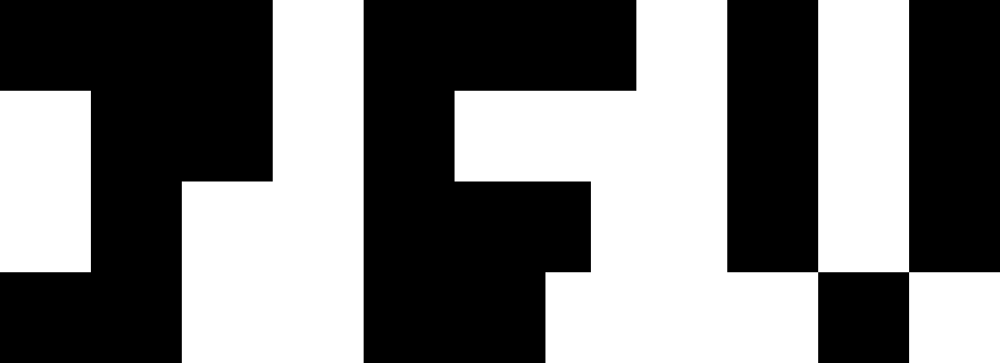

<div align="center">
  
</div>

<h1 align="center"><a href="https://twitter-followers-video.vercel.app/" target="_blank">Twitter Followers Video</a></h1>

<p align="center">
  <strong>Generate animated videos to celebrate and share your Twitter/X follower milestones.</strong>
</p>

<div align="center">

[](https://github.com/Aniket-508/twitter-followers-video/stargazers)
[](https://github.com/Aniket-508/twitter-followers-video/blob/main/LICENSE)
[](https://github.com/sponsors/Aniket-508)

</div>

## Example Output

https://github.com/user-attachments/assets/0840d4b8-1fd0-4dfd-bf75-0a0287a734ec

## Stack

- [Remotion](https://www.remotion.dev/) to create the video (and [Remotion Lambda](https://www.remotion.dev/docs/lambda/api) to generate it in AWS)
- [Next.js](https://nextjs.org) for the web application
- [TailwindCSS](https://tailwindcss.com) for the styling
- [Vercel](https://vercel.com) for hosting

## Getting Started

### Prerequisites

- Node.js 22+ or Bun
- AWS account (for Lambda rendering)

### Installation

```bash
# Clone the repository
git clone https://github.com/yourusername/twitter-followers-video.git
cd twitter-followers-video

# Install dependencies
bun install
```

### Development

```bash
# Start the Next.js dev server
bun run dev

# Open Remotion Studio to preview animations
bun run remotion
```

### Rendering

```bash
# Render a video locally
bunx remotion render

# Upgrade Remotion
bunx remotion upgrade
```

## AWS Lambda Setup

This project supports rendering videos via [Remotion Lambda](https://remotion.dev/lambda) for serverless video generation.

1. Copy `.env.example` to `.env` and fill in your AWS credentials
2. Complete the [Lambda setup guide](https://www.remotion.dev/docs/lambda/setup)
3. Edit `config.mjs` with your desired Lambda settings
4. Deploy your Lambda function:

```bash
node deploy.mjs
```

Run the deploy script after:

- Changing the video template
- Modifying `config.mjs`
- Upgrading Remotion

## Contributing

If you want to suggest a feature or report a problem, feel free to open an issue or even a pull request 😉.

## Credits

- Animation inspired from this [tweet](https://x.com/Jerrythe2d/status/2013269485210456335) by [Jerry](https://x.com/Jerrythe2d)

## License

This project is licensed under the MIT License - see the [LICENSE](LICENSE) file for details.
